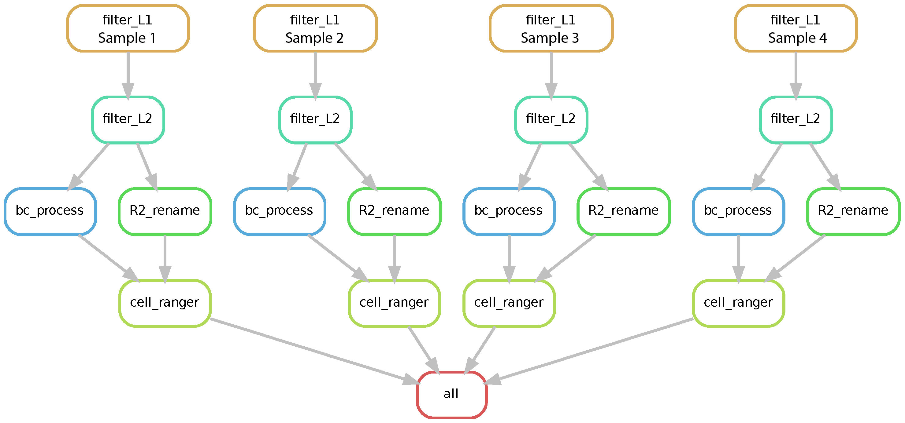

# Spatial ATAC-seq
A snakemake pipeline to process spatial ATAC-seq raw data

## Work flow of the pipeline



## Dependiencies

* [Snakemake](https://snakemake.readthedocs.io/en/stable/index.html). snakemake is python3
* [Biopython](https://biopython.org/docs/1.75/api/index.html).
* [Cell Ranger ATAC](https://support.10xgenomics.com/single-cell-atac/software/pipelines/latest/installation). v1.2
* [BBMap](https://jgi.doe.gov/data-and-tools/bbtools/bb-tools-user-guide/installation-guide/).

## Run the pipeline
1. Replace the cellranger-atac-cs/1.2.0/lib/python/barcodes/737K-cratac-v1.txt with the new barcodes file in this fold.
2. Configure Snakefile
3. Configure cluster.json
4. Configure Snakemake.sh
5. To run the pipeline, use the command:
```
sbatch Snakemake.sh
```
